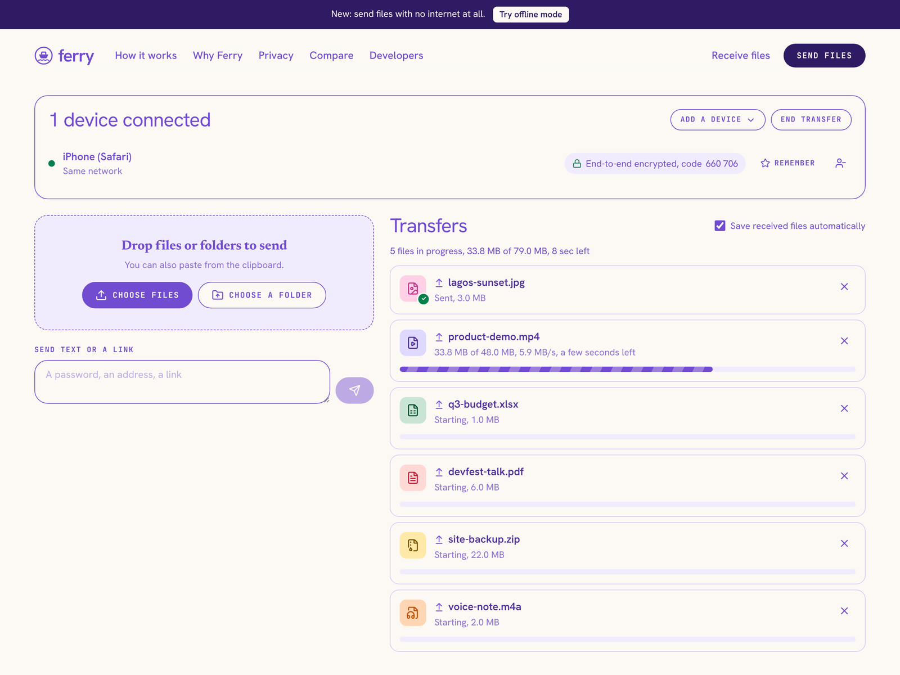
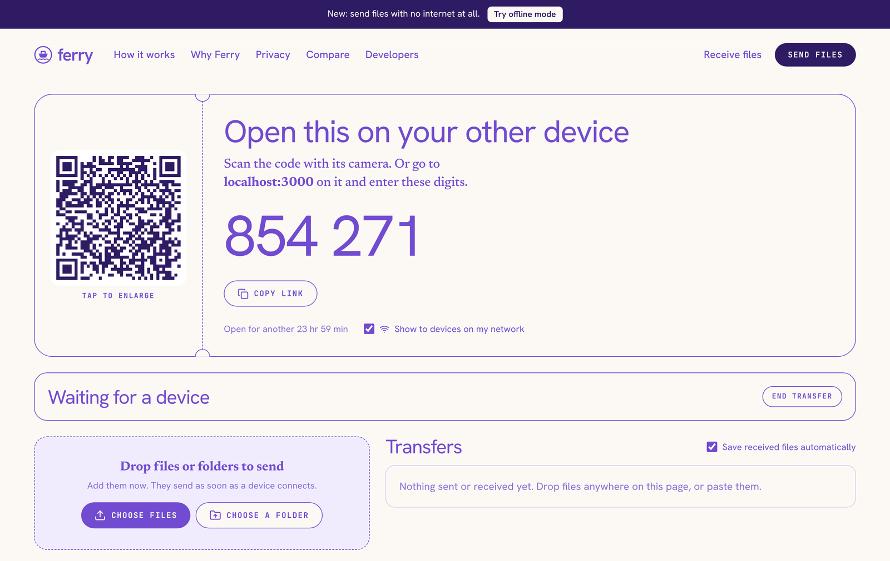
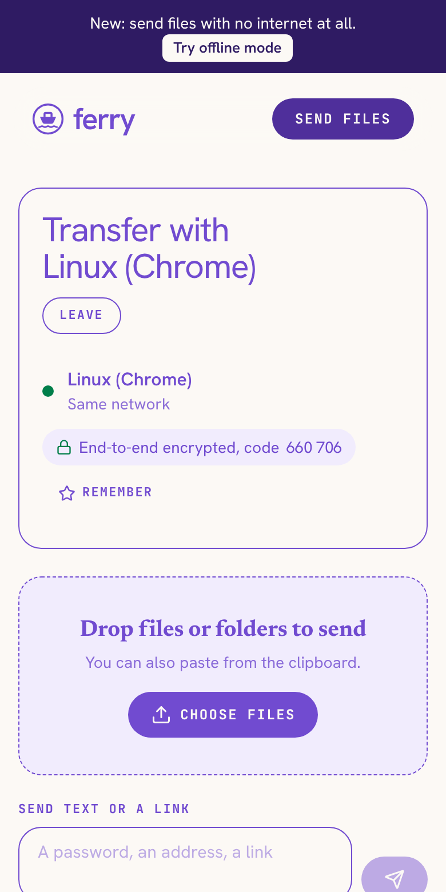
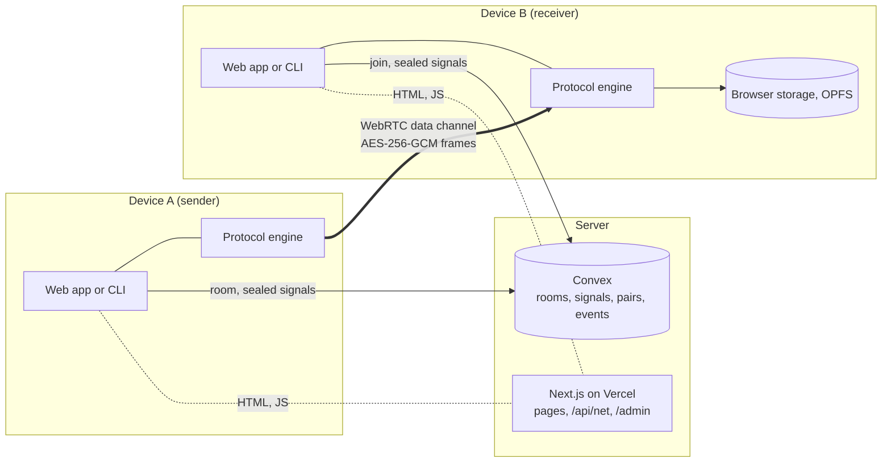
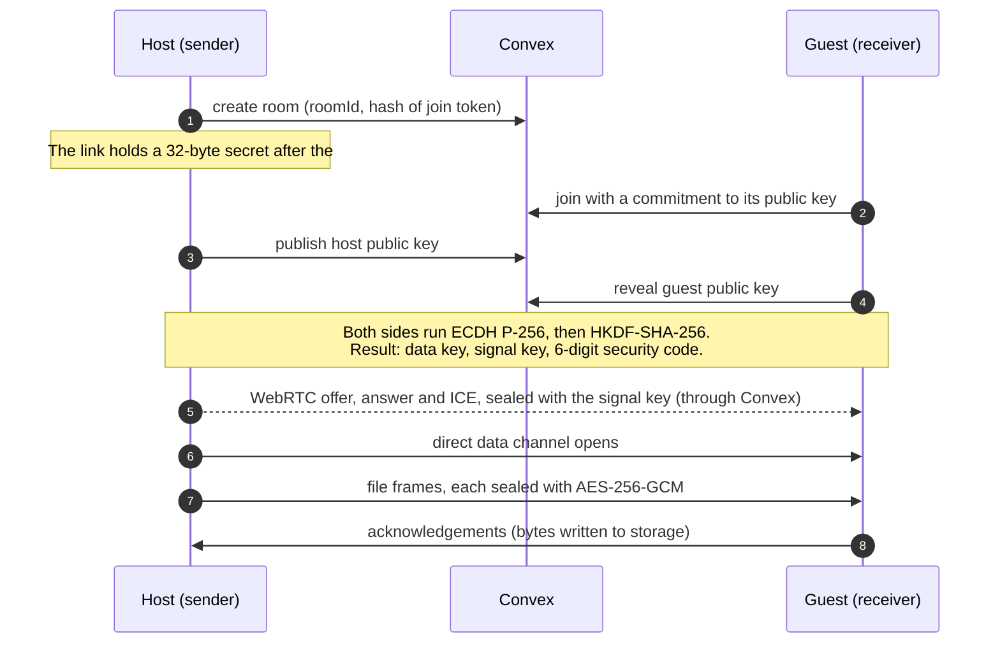
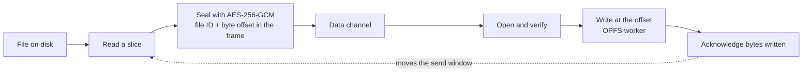

<p align="center">
  
</p>

<h1 align="center">Ferry</h1>

<p align="center">
  Send files, folders and text straight from one device to another.<br>
  End-to-end encrypted, no account, no upload, no size cap.
</p>

<p align="center">
  <a href="https://ferry.sholajegede.com"><strong>ferry.sholajegede.com</strong></a>
  ·
  <a href="https://ferry.sholajegede.com/developers">CLI and API</a>
  ·
  <a href="https://ferry.sholajegede.com/compare">Comparisons</a>
</p>

<p align="center">
  <a href="LICENSE"></a>
  
  
  
</p>



## What Ferry is

Ferry moves files between two devices that are both open at the same time. One device starts a transfer and shows a QR code, a link and a 6-digit code. The other device opens any of the three. The files then travel directly between the two devices over WebRTC.

The server only introduces the devices to each other. It never receives a file, a file name or an encryption key.

Ferry is a Next.js app (App Router) with a Convex backend, plus a command line tool that speaks the same protocol.

## Features

- **No size cap.** The receiver writes each piece to storage as it arrives, so a 40 GB file does not have to fit in memory.
- **End-to-end encryption.** Every piece is sealed with AES-256-GCM. The keys come from an ECDH exchange between the two devices, and both screens show the same 6-digit security code.
- **Resume.** After a dropped connection or a page reload, a transfer continues from the last byte the receiver saved.
- **Four ways to connect.** QR code, link, 6-digit code, or a list of senders on the same network.
- **Up to 16 devices in one transfer.** A device that joins late gets the files already shared.
- **Folders.** They keep their structure, and the receiver can save a batch as one zip.
- **Text and links.** Paste from the clipboard, or type a note.
- **Remembered devices.** Two devices that trust each other can start a transfer with one tap.
- **Offline mode.** Two devices on the same Wi-Fi or hotspot connect by scanning each other's QR codes. No server is contacted.
- **Installable.** Ferry installs as an app and appears in the Android share sheet.
- **Command line tool and HTTP API.** A terminal can send to a phone, and a build server can send to a browser.

| Start a transfer | Join from a phone |
| --- | --- |
|  |  |

## Architecture



There are three parts.

1. **The protocol engine** (`src/lib/protocol/`). It handles key agreement, the reconnecting WebRTC link, framing, flow control and resume. It has no browser or Node dependencies. The web app and the CLI each give it a small `Platform` and `Backend` object.
2. **The Convex backend** (`convex/`). It stores rooms, guests and short-lived signaling messages, and it runs the cleanup job. Clients subscribe to queries, so a new signaling message reaches the other device without polling.
3. **The Next.js app** (`src/app/`, `src/components/`). It renders the interface, signs network tokens at `/api/net`, and serves the admin page.

### How two devices connect



A guest that joined with the link mixes the link secret into the key derivation. The server never sees that secret, so it cannot place itself between the two devices.

A guest that joined with the 6-digit code or from the nearby list has no link secret. The host sees the security code and the guest's name, and admits the guest only after checking that both screens match.

### How a file moves



Each frame carries a 16-byte file ID and the byte offset of its payload. The receiver acknowledges what it has written to storage. The sender keeps at most 16 MB unacknowledged. That one number does two jobs: it is the flow control, and after a reconnect it is the point to resume from.

## Decisions and the reasons for them

**Convex carries signaling and nothing else.** Signaling needs a database with live queries and little more. Convex gives both, so there is no WebSocket server to run. File data never passes through it, which keeps the hosting cost flat no matter how much people send.

**Encryption sits above WebRTC.** A data channel is already encrypted in transit with DTLS. That protects against the network, but not against a signaling server that swaps the keys. Ferry runs its own key exchange and seals every frame itself, so the guarantee does not depend on trusting the server.

**The guest commits to its key before the host reveals one.** A 6-digit code has about 20 bits. Without a commitment, an attacker in the middle could try keys until the codes matched. With it, the attacker gets one guess in a million.

**The link secret lives in the URL fragment.** The part of a URL after `#` stays in the browser. The server stores only a hash of a token derived from the secret, which is enough to check that a guest holds the link.

**Device identity without accounts.** A browser creates a random device ID and a secret on first use. The server stores a SHA-256 hash of the secret. That is enough to stop one device from acting as another, and there is no sign-up form.

**A star, not a mesh.** In a transfer with several devices, each guest connects to the host only. The host is the one with the files, and a mesh would multiply connections with no gain.

**The acknowledgement is the resume point.** There is no separate resume protocol. The receiver reports bytes written to storage, and the sender continues from there after any break.

**Files go to storage as they arrive.** The receiver writes to the origin private file system from a worker, with a small record in IndexedDB. A browser without that API falls back to memory, with a 512 MB limit.

**One protocol engine for the browser and the terminal.** `src/lib/protocol/` imports nothing from the DOM or from Node. The CLI bundles the same code with a WebRTC library for Node.

**Offline mode exchanges the connection details by hand.** With no server to pass messages, each device shows its WebRTC description as a QR code (or a short text code) and reads the other one. It takes one more scan than the online flow, and it works with no internet at all.

**No relay by default.** Some office, school and mobile networks block direct connections. A TURN relay fixes that and costs money per gigabyte, so it is opt-in. Relayed data is still encrypted end to end.

**Usage statistics without identities.** The admin page shows countries, device types and file types. Events store a visitor code that changes every day, and never a file name, a device ID or an IP address. They are deleted after 120 days.

**Share images are files, not routes.** `npm run og` renders the preview images to `public/og/`. Social crawlers fetch a plain PNG with a known size, which is more reliable than an image rendered on request.

**Tests call the real backend functions.** The browser tests run real WebRTC transfers between several Chromium windows and the CLI. A small bridge runs the Convex functions through `convex-test`, so the tests need no deployment.

## Run it locally

You need Node.js 22 or later and a Convex account.

```bash
git clone https://github.com/sholajegede/ferry.git
cd ferry
npm install
npm run setup
npm run dev
```

`npm run setup` signs you in to Convex, creates the project, pushes the functions, and writes the secrets to `.env.local` and to Convex. It prints the password for the admin page.

Open http://localhost:3000 in two browser windows. Use a second browser or a private window for the second one, because two tabs of one browser share a device identity.

### Try it with a phone

Browsers allow WebRTC and the Web Crypto API only on HTTPS or localhost. To reach your computer from a phone on the same Wi-Fi:

```bash
npm run dev:https
```

Then open `https://<your computer's IP>:3000` on the phone and accept the self-signed certificate.

## Configuration

| Variable | Where | Purpose |
| --- | --- | --- |
| `NEXT_PUBLIC_CONVEX_URL` | Web app | Address of the Convex deployment |
| `NEXT_PUBLIC_SITE_URL` | Web app | Public address, used for links, the sitemap and share images |
| `NETWORK_SECRET` | Web app and Convex | Signs the tokens behind "On your network now" and the location data |
| `ANALYTICS_KEY` | Web app and Convex | Lets the admin page read usage statistics |
| `ADMIN_PASSWORD` | Web app | Password for `/admin`, 12 characters or more |
| `NEXT_PUBLIC_OPERATOR_NAME`, `NEXT_PUBLIC_CONTACT_EMAIL` | Web app | Shown on the privacy and terms pages |
| `CLOUDFLARE_TURN_KEY_ID`, `CLOUDFLARE_TURN_API_TOKEN` | Convex | Optional Cloudflare relay |
| `TURN_URLS`, `TURN_USERNAME`, `TURN_CREDENTIAL` | Convex | Optional relay on any TURN server |

`.env.example` lists them all.

## Command line

```bash
npm run cli:build
node cli/dist/index.js send report.pdf photos/
node cli/dist/index.js receive 482107 --out ~/Downloads
```

`send` prints a QR code, a link and a 6-digit code, and exits when every file has arrived. `receive` takes the code or the link.

The package in `cli/` is named `ferry-send` and is not on npm yet. After it is published, `npx ferry-send send report.pdf` does the same thing.

The build reads `NEXT_PUBLIC_CONVEX_URL` and `NEXT_PUBLIC_SITE_URL` from `.env.local` and uses them as defaults. `--server` and `--site` override them. See [cli/README.md](cli/README.md) for the options.

## HTTP API

The API creates and inspects transfers. File data never passes through it.

| Request | Purpose |
| --- | --- |
| `POST /v1/rooms` | Create a transfer. Returns the room ID, the 6-digit code and device credentials |
| `GET /v1/rooms/:id` | Read the state of a transfer |

The [developers page](https://ferry.sholajegede.com/developers) documents the request bodies and the key derivation.

## Tests

```bash
npm test
```

This runs the protocol tests (encryption, resume, cancel, wrong key) and the backend access-control tests.

The browser tests need the bridge, a production build and a folder of test files:

```bash
npx playwright install chromium
npm run cli:build
npm run test:bridge                                                        # terminal 1
NEXT_PUBLIC_TEST_BRIDGE=http://localhost:4455 npm run build && npm start   # terminal 2
E2E_FILES=/path/to/test-files npm run test:e2e                             # terminal 3
```

`E2E_FILES` holds `photo.bin` (a few MB), `movie.bin` (a few hundred MB) and a folder named `album` with a subfolder.

## Deploy

1. Set `NETWORK_SECRET` and `ANALYTICS_KEY` in the production Convex deployment, then run `npx convex deploy`.
2. Deploy the Next.js app to Vercel or any Node host. Set the variables from the table above, with `NEXT_PUBLIC_CONVEX_URL` set to the production Convex address.
3. Run `npm run og` after you change `NEXT_PUBLIC_SITE_URL`, so the share images show your address.

The API is served from the site's own domain. A rewrite in `next.config.ts` forwards `/v1/...` to the Convex HTTP actions.

Country and city in the admin page come from headers that Vercel and Cloudflare add. On other hosts those fields stay empty.

## Project layout

| Path | Contents |
| --- | --- |
| `convex/` | Schema and functions: devices, rooms, signaling, remembered devices, statistics, TURN credentials, the HTTP API, the cleanup job |
| `src/lib/protocol/` | The transfer engine, shared by the web app and the CLI |
| `src/lib/web/` | Browser storage, file sources, zip, pairing, offline mode |
| `src/app/`, `src/components/` | Pages and interface |
| `public/sw.js` | Service worker: offline shell and the share target |
| `cli/` | The command line tool |
| `scripts/` | Setup and share-image scripts |
| `tests/` | Protocol, backend and browser tests |

## Limits

- Both devices must have Ferry open at the same time. Ferry stores nothing, so there is no link to download from later.
- The receiver needs free browser storage for the whole file. Saving copies it to the download folder, so a large file needs that space twice until the browser clears the first copy.
- With no relay configured, a transfer fails on networks that block direct connections.
- A remembered device must have Ferry open to get the incoming-transfer prompt. There are no push notifications.
- "On your network now" matches devices by public IP address. On a network that many strangers share, turn it off with the checkbox on the transfer screen.
- The privacy policy and terms describe what the code does. Have them reviewed before you run a public instance of your own.

## Contributing

Bug reports and pull requests are welcome. [CONTRIBUTING.md](CONTRIBUTING.md) explains how to set up, what the checks are, and what a good change looks like.

To report a security problem, follow [SECURITY.md](SECURITY.md) and do not open a public issue.

## Licence

[MIT](LICENSE). Built by [Shola Jegede](https://sholajegede.com).
